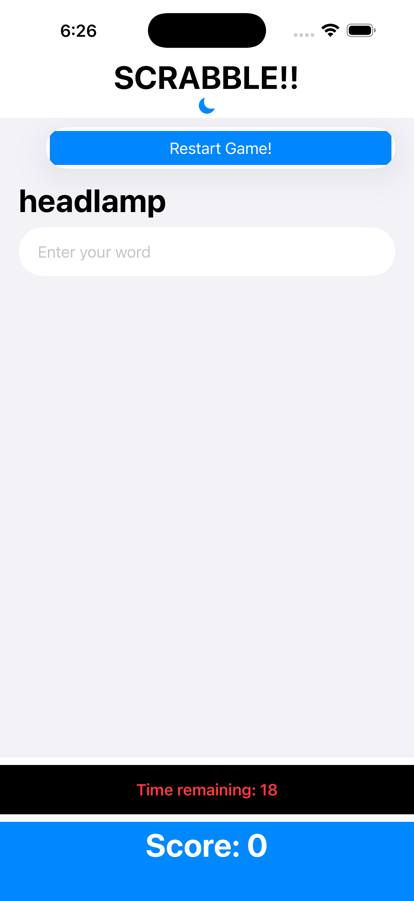
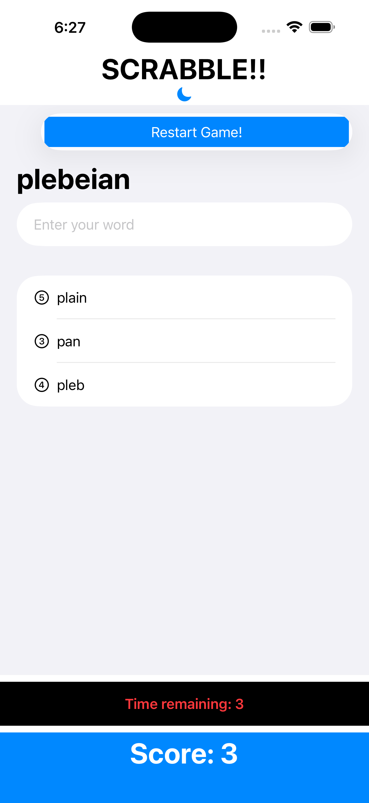
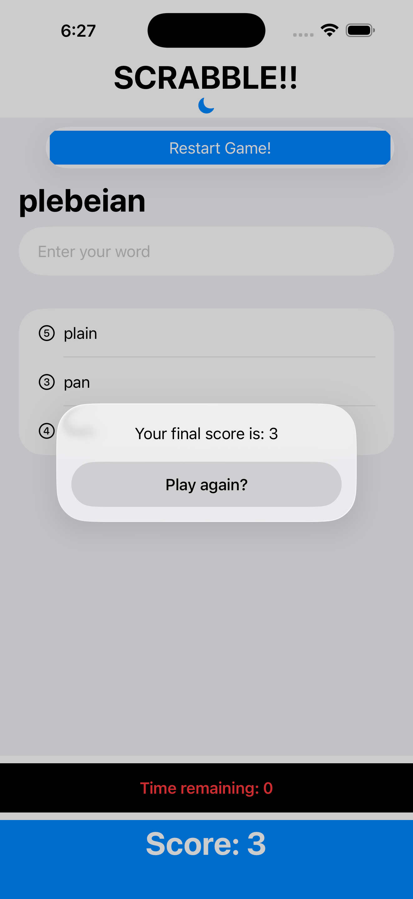
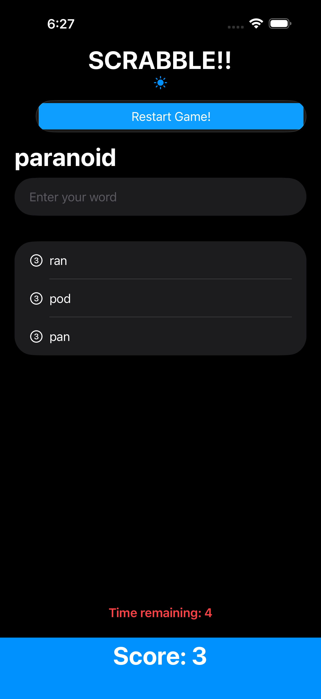
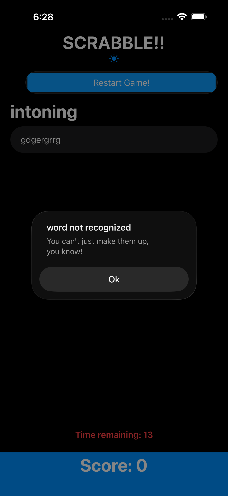
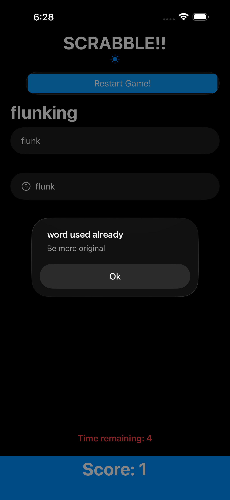
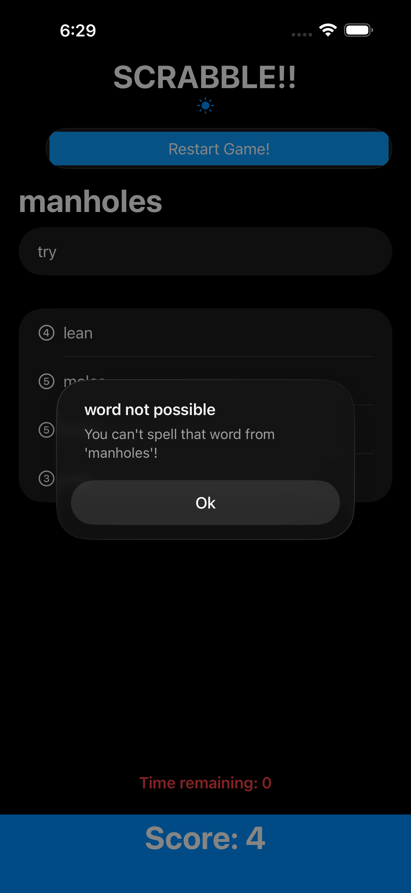
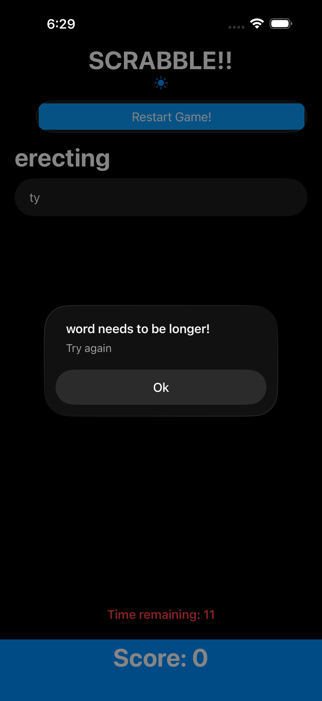

# 🔤 Word Scramble — Day 31 of 100 Days of SwiftUI - Complete

A Scrabble-inspired word game built with SwiftUI as part of Paul Hudson's [100 Days of SwiftUI](https://www.hackingwithswift.com/100/swiftui) challenge.

---

## 📱 About the App

Players are given a random root word and must form as many valid words as possible using its letters — before the timer runs out!

---

## ✅ Day 31 Challenges

### 1. Minimum Word Length
> Disallow answers that are shorter than three letters or are just the start word.

Added a new `isLong()` validation function and a corresponding `guard` in `addNewWord()` to reject words under 3 letters.

### 2. Restart Button
> Add a toolbar button that calls `startGame()`, so users can restart with a new word whenever they want.

Added a toolbar button that resets the board, clears previously submitted words, resets the score, and loads a new root word.

### 3. Score Tracking
> Put a text view somewhere to track and show the player's score.

Added a pinned score bar at the bottom of the screen. Each valid word submitted adds 1 point. Score resets on restart.

---

## ⭐ Personal Challenges

| Feature | Description |
|---|---|
| 🎮 Title | Added a bold "SCRABBLE!!" title at the top |
| 🌙 Dark / Light Mode | Toggle button that switches between dark and light mode |
| 🏆 Final Score Popup | When the game ends, an alert shows your final score with a "Play Again?" button |
| ⏱️ Countdown Timer | 20-second countdown timer — when it hits 0, the game ends automatically |

---

## 🛠️ Key Concepts Used

- `@State` for managing game state
- `List` with multiple `Section` views
- `.toolbar` and `ToolbarItem` for navigation bar buttons
- `UITextChecker` for real word validation
- `Timer.scheduledTimer` for the countdown
- `.alert` for error messages and final score display
- `guard` statements for input validation
- `withAnimation` for smooth word insertion

---

## 📸 Screenshots

---

## 🚀 How to Run

1. Clone the repo
2. Open in Xcode
3. Make sure `start.txt` is included in the bundle
4. Run on simulator or device (iOS 16+)

---

*Part of my [100 Days of SwiftUI](https://www.hackingwithswift.com/100/swiftui) journey by Paul Hudson.*
