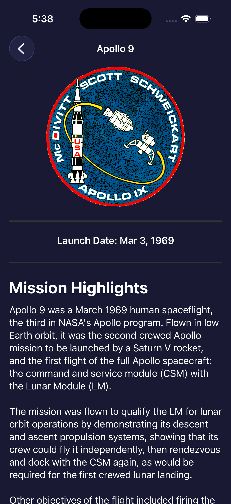
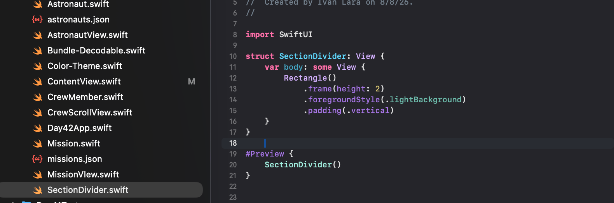
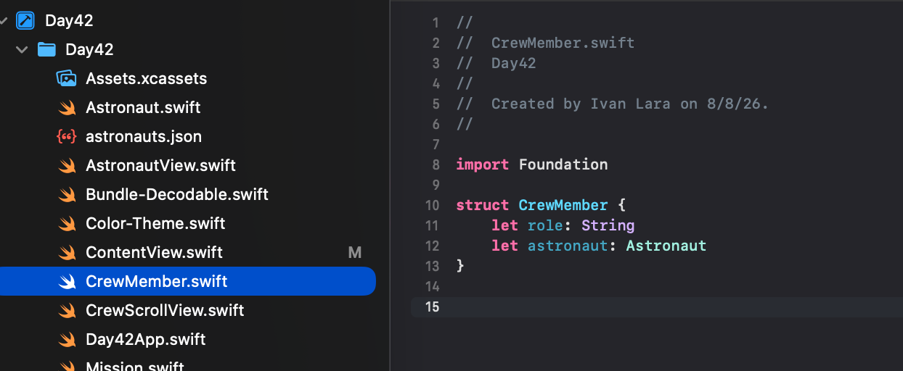
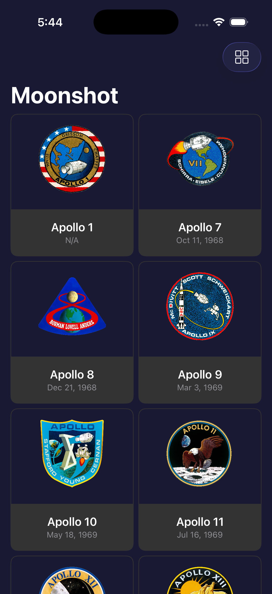
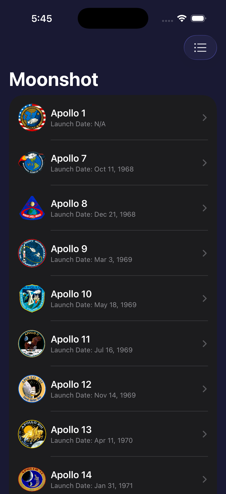

# Day 42 - Moonshot Project 8, part 4 - Challenge


Building on the completed Moonshot app (Project 8), today's challenge focused on polishing the UI and improving code organization across three parts.

---

## Challenge 1: Add Launch Date to `MissionView`

**Goal:** Display the mission's launch date below the mission badge in `MissionView`.

**What I did:**
- Reused the existing `formattedLaunchDate` computed property on the `Mission` struct, which already handled formatting (`.formatted(date: .abbreviated, time: .omitted)`) and provided a fallback of `"N/A"` for missions with no launch date (e.g. Apollo 1).
- Added a `Text` view referencing `mission.formattedLaunchDate`, styled with `.font(.body.bold())`.
- Centered it using `.frame(maxWidth: .infinity, alignment: .center)`.

**Key learnings:**
- Computed properties belong on the *model* (`Mission`), not redeclared inside a view's `body` — a `body` is composed of views, not property declarations.
- `frame(maxWidth: .infinity, alignment:)` is the standard way to center a view within its available horizontal space.



---

## Challenge 2: Extract Reusable Views

**Goal:** Pull repeated view code out of `MissionView` into standalone, reusable SwiftUI views.

### `SectionDivider`
- Extracted the repeated `Rectangle()` divider styling (used 3× in `MissionView`) into its own view:
  ```swift
  struct SectionDivider: View {
      var body: some View {
          Rectangle()
              .frame(height: 2)
              .foregroundStyle(.lightBackground)
              .padding(.vertical)
      }
  }
  ```
- Even with zero parameters, extracting pure styling into its own view creates a single source of truth — one place to update instead of several.

### `CrewMember` → promoted to its own model file
- `CrewMember` was originally a nested struct inside `MissionView`. To share it with a new extracted view, it needed to become a top-level model (like `Mission` and `Astronaut`), living in its own `CrewMember.swift` file.

### `CrewScrollView`
- Extracted the horizontal crew scroll view (with its `NavigationLink`s to `AstronautView`) into its own `CrewScrollView`, taking `crew: [CrewMember]` as a property.
- Wired back into `MissionView` with `CrewScrollView(crew: crew)`.

**Key learnings:**
- Nested types are only visible within the type they're nested in — anything shared across multiple views needs to be a top-level type.
- A data model (like `CrewMember`) is not a `View` — it shouldn't conform to `View` or have a `#Preview`.
- Extracting views isn't just about dynamic data — pure styling/layout is just as valid a candidate for extraction.




---

## Challenge 3: Toolbar Toggle Between Grid and List Views

**Goal:** Add a toolbar item to `ContentView` that toggles missions between a grid layout and a list layout.

**What I did:**
1. Added `@State private var showingGrid = true` to track the current layout.
2. Wrapped the existing `LazyVGrid` and a new `List`-based layout in an `if showingGrid { ... } else { ... }`, both nested inside a `Group` (needed because modifiers like `.navigationTitle` can't attach directly to an `if/else` statement).
3. Built the list row layout: thumbnail image (`.clipShape(.circle)`) on the left, mission name + launch date stacked in a `VStack(alignment: .leading)` on the right.
4. Fixed the `List`'s default background overriding the custom `.background(.darkBackground)` by adding `.scrollContentBackground(.hidden)` to the `List`.
5. Added a `.toolbar { }` modifier with a `ToolbarItem` containing a `Button` that calls `showingGrid.toggle()`, using an SF Symbol icon (`Image(systemName:)`) that switches between a grid icon and a list icon depending on state.

**Key learnings:**
- `Group` lets you treat conditional/multiple views as a single unit so modifiers can be chained onto them.
- `List` has its own default background that can override an outer `.background()` — `.scrollContentBackground(.hidden)` fixes this.
- `Bool.toggle()` is the idiomatic way to flip a boolean state in SwiftUI, rather than `showingGrid = !showingGrid`.
- Toolbar buttons follow the same `Button { action } label: { content }` pattern used elsewhere (like `NavigationLink`).




---

## Summary

All three challenges reinforced core SwiftUI patterns: reusing computed properties across views, extracting reusable view components, promoting nested types to top-level models, and using `@State` + conditional views to drive dynamic UI changes — all while keeping styling consistent across the app.
