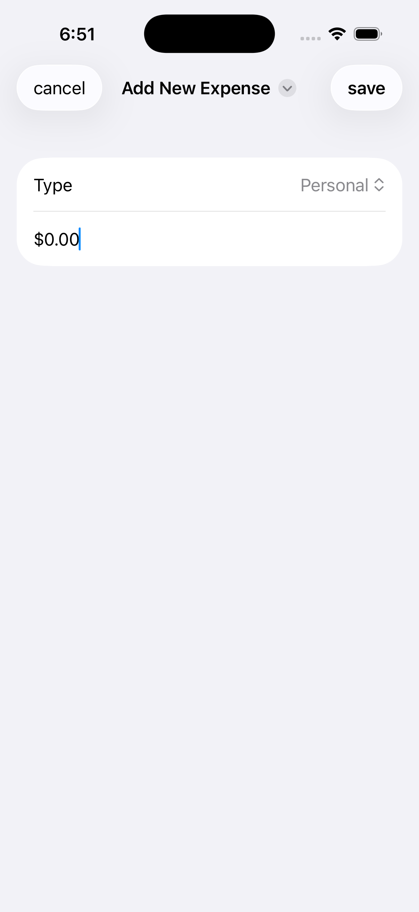
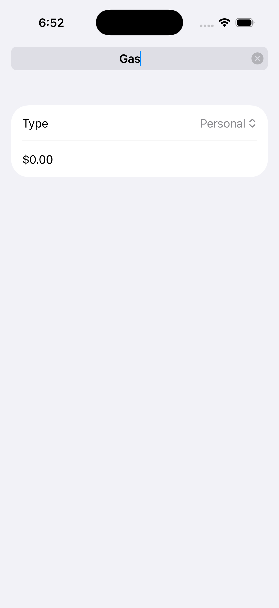
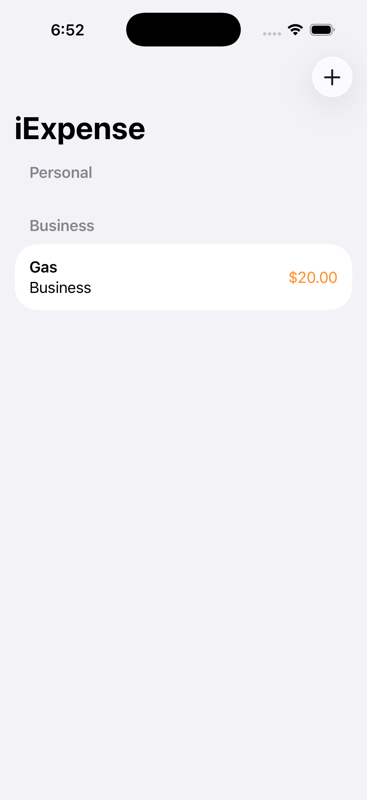

# Day 46 - Navigation Project 9, part 4 - Challenge

## Challenge 1: NavigationLink instead of Sheet

**Goal:** Replace the `.sheet()` presentation for adding expenses with `NavigationLink`, so `AddView` pushes onto the stack instead of appearing modally.

**Changes made:**
- **`ContentView`:** Swapped the toolbar `Button` for a `NavigationLink`:
  ```swift
  .toolbar {
      NavigationLink {
          AddView(expenses: expenses)
      } label: {
          Label("Add Expense", systemImage: "plus")
      }
  }
  ```
  Removed the now-unused `@State private var showingAddExpense` and the `.sheet()` modifier.

- **`AddView`:** Removed its internal `NavigationStack` wrapper (no longer needed — it's now pushed onto `ContentView`'s existing stack, not shown as an independent screen).

- Added `.navigationBarBackButtonHidden()` so the default swipe/tap-back gesture is disabled, forcing an explicit choice.
- Added an explicit **Cancel** button using semantic toolbar placements:
  ```swift
  .toolbar {
      ToolbarItem(placement: .cancellationAction) {
          Button("cancel") { dismiss() }
      }
      ToolbarItem(placement: .confirmationAction) {
          Button("save") {
              let item = ExpenseItem(name: name, type: type, amount: amount)
              expenses.items.append(item)
              dismiss()
          }
      }
  }
  ```

**Result:** Cancel appears left, Save appears right, no back button — matches expected iOS conventions for a modal-style flow now living on the nav stack.

---

## Challenge 2: Editable Navigation Title vs. TextField

**Goal:** Let users set the expense name via the navigation title instead of a separate `TextField`.

**Changes made:**
- Removed `TextField("Name", text: $name)` from the `Form`.
- Bound the navigation title directly to the `name` state:
  ```swift
  @State private var name = "Add New Expense"
  ...
  .navigationTitle($name)
  .navigationBarTitleDisplayMode(.inline)
  ```
- Gave `name` a non-empty starting value (`"Add New Expense"`) — binding it to `""` left the title bar blank until the user tapped it, which was confusing. Starting with placeholder text keeps the title visible immediately and tappable to rename.

**Behavior:** Tapping the title reveals a rename field — user can retype the name inline, then Save/Cancel as usual.





**Trade-off note:** If the user doesn't tap to rename, the expense saves with the placeholder text ("Add New Expense") as its literal name — a minor UX quirk worth knowing.

### My take: which do I prefer?
The **`TextField`** approach feels more intuitive — it's immediately recognizable as an editable field with placeholder text, and fits naturally alongside the other form fields (Picker, Amount). The editable title trick is neat and saves space, but it's a hidden interaction users have to already know about; it works better when the title truly *is* the primary piece of data being created (e.g. renaming a note), rather than one of several fields in a form.
