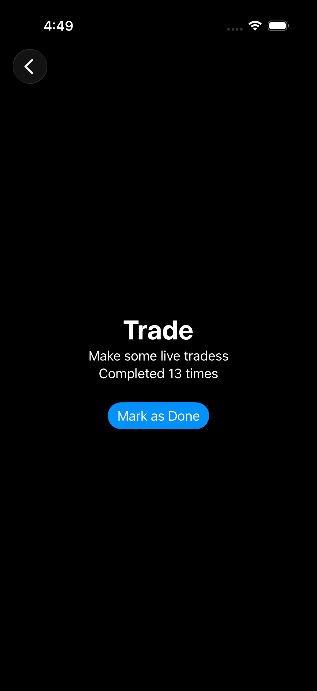
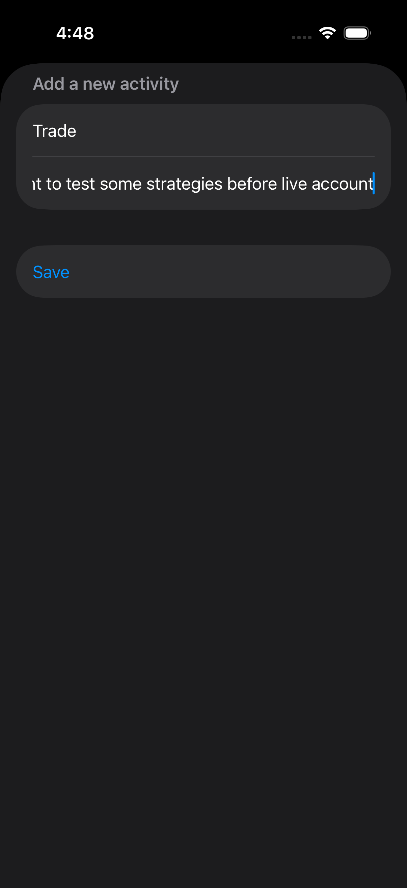
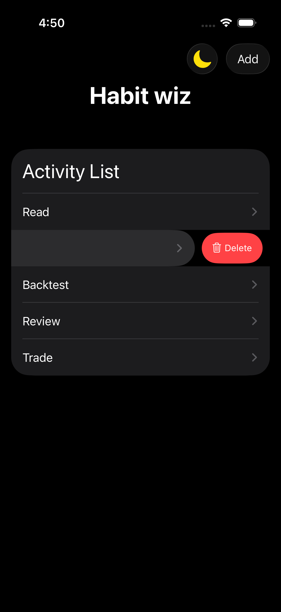
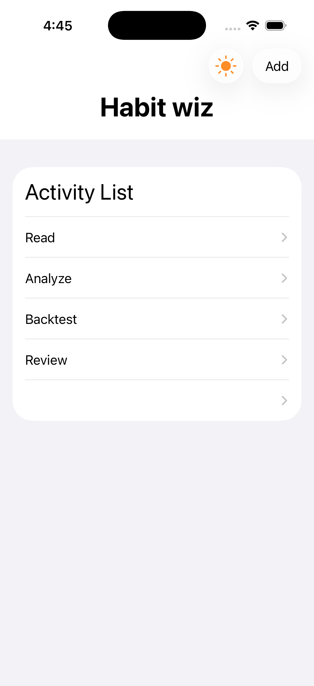
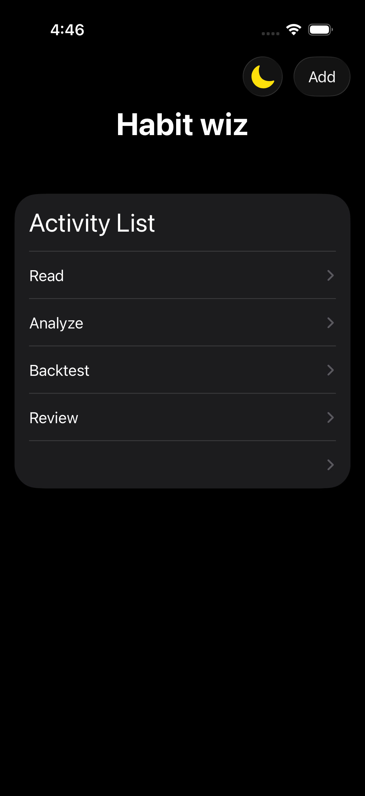

# Day 47 - Milestone Porject - Habit Wiz 🎯

A simple SwiftUI habit-tracking app built as a milestone project — combining the core concepts from three prior 100 Days of SwiftUI projects (state management, navigation, data persistence, and Codable) into a complete, standalone app.

## Overview

Habit Wiz lets users track custom habits or activities — anything from practicing an instrument to reading or exercising. Users can add new activities, view details, log completions, and remove activities they no longer want to track — all with data that persists between app launches.

## Screenshots

| Activity List | Add Activity |
|---|---|
|  |  |

| Swipe to Delete | Light Mode | Dark Mode |
|---|---|---|
|  |  |  |

## Features

- 📋 **Activity list** — view all tracked activities at a glance
- ➕ **Add new activities** — a form-based sheet for entering a title and description
- 🔍 **Detail view** — tap any activity to see its full description
- ✅ **Completion tracking** — a "Mark as Done" button increments a running completion count per activity
- 🗑️ **Swipe to delete** — remove activities you no longer want to track
- 🌗 **Dark mode toggle** — a sun/moon icon button in the toolbar to switch between light and dark appearance, independent of the system setting
- 💾 **Persistence** — all data is saved locally using `Codable` and `UserDefaults`; the dark mode preference is saved with `@AppStorage`, both surviving app restarts

## Technical Concepts Used

This project was an exercise in applying and reinforcing several core Swift and SwiftUI concepts:

- **`@State` / `@Binding`** — managing and sharing mutable state across parent and child views
- **Value vs. reference type behavior** — working through how struct mutations propagate (or don't) through a view hierarchy, and using `Binding<Activity>` to correctly flow completion-count updates from a detail view back to the source array
- **`NavigationStack` / `NavigationLink`** — pushing a detail view onto the navigation stack
- **`.sheet(isPresented:)`** — presenting a modal form for adding new activities
- **`@Environment(\.dismiss)`** — dismissing the add-activity sheet programmatically after saving
- **`.toolbar` / `ToolbarItem` / `ToolbarSpacer`** — placing multiple distinct buttons in the navigation bar without them visually merging into one grouped control
- **`ForEach($array)`** — iterating over an array while producing a `Binding` to each individual element
- **`.onDelete(perform:)`** — enabling swipe-to-delete on the activity list, backed by `Array.remove(atOffsets:)`
- **`Codable`** — encoding and decoding the `Activity` model to/from JSON
- **`Equatable`** — required for `.onChange(of:)` to detect changes in the activities array
- **`UserDefaults`** — persisting the encoded activity data locally between launches
- **`@AppStorage`** — persisting a single `Bool` (dark mode preference) automatically via `UserDefaults`, without manual encode/decode
- **`.preferredColorScheme(_:)`** — overriding the system light/dark appearance based on user preference

## Data Model

```swift
struct Activity: Identifiable, Codable, Equatable {
    var title: String
    var description: String
    var id: UUID = UUID()
    var completionCount: Int = 0
}
```

## Project Structure

```
Day47/
├── ContentView.swift       // Main list screen, owns the source-of-truth activities array
├── Activity.swift          // Activity data model
├── ActivityRow.swift       // A single row in the list, wraps a NavigationLink
├── ActivityView.swift      // Detail screen with description and completion tracking
└── AddActivityView.swift   // Form sheet for creating a new activity
```

## What I'd Add Next

- Editing an existing activity's title/description
- Sorting/filtering activities by completion count
- Visual polish — custom icons per activity, charts of completion history over time
- Reset/undo option for accidental deletions

## Background

Built as a milestone/challenge project from the *100 Days of SwiftUI* course, designed to combine everything learned across three prior projects — `@State` vs `@Observable`, sheet presentation, list editing, `UserDefaults`, `Codable`, generics, and navigation — into one complete app built from scratch.
